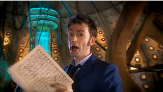

# Music score

## Goals

To rest from his stressful last adventure, Doctor Who decides to attend a music
recital performed by Her Majesty the Queen’s Royal Orchestra. Since he doesn’t
want to be seen in public, the Doctor uses the TARDIS to channel the music
directly from the Opera to his home.

But behold! The infamous [Graske](http://tardis.wikia.com/wiki/Graske) has
detected an opportunity to do evil: the sound waves channelled by the TARDIS
have created a space-time crack that the alien is using to travel through
dimensions. He should soon reach Earth and annihilate the human race. Nothing
less could have been expected from this vile creature!

The Doctor soon realizes that the only way to prevent this terrible fate is to
make the TARDIS play the melodies backwards. This will reverse the polarity of
the neutron flow and banish the Graske to the other side of the universe.

Unfortunately the melodies are only available on musical scores on paper and the
TARDIS is not (yet) equipped with a score reader.

Your mission is to help Doctor Who defeat the Graske. To do so, __you have to
implement an interface that can read scanned musical scores directly from paper
and translate them into musical notes__.

## Rules

The musical scores are fairly simple and only feature half notes (?) and quarter
notes (?). Notes are all represented on a staff and are limited to the following
musical notes (either half or quarter):

Notes are labelled using the English convention: A B C D E F and G

As a reminder (for those not familiar with reading music):
- On a score, a "staff" always contains 5 lines. Notes are either located
accross a line or between two lines.
- The first C note is located on a specific segment - a ledger line - below the
5 other lines.
- The notes have tails which can either go up - until the first A - or down -
from the second C. The tail of the B can go either way.
- The label of a note (A, B, C, etc.) is independant of whether the note is a
half or quarter note.

You are provided with scanned images of the scores in black and white encoded in
a simple, yet efficient, form of
[RLE](https://en.wikipedia.org/wiki/Run-length_encoding) (Run-Length Encoding):
the DWE (Doctor Who Encoding) algorithm. In the DWE, consecutive pixels of the
same color are encoded using a letter (B for black pixels, W for white pixels)
followed by a space followed by the number of pixels of that color.

For example: W 5 B 20 W 16 means 5 white pixels, followed by 20 black pixels,
followed by 16 white pixels.

Encoding is done from top to bottom. When the image width is known,
reconstructing the original image is straightforward.

Within the images, the scores and notes have various sizes. To fully understand
the challenge at hand, you should check all the images from this
[page](https://files.codingame.com/pub/dw/dw2-allimages.html). They correspond
to the challenge tests further down.

__All the test cases are contained within these 12 images and if your code can
process them all, then you are good to go!__

## Game Input

### Input

__Line 1:__ the width `W` and height `H` of the image in pixels.

__Line 2:__ the image encoded from top to bottom using the DWE algorithm:
several couples of `C L` separated by spaces. `C` is the color of the pixels
(either `B` for black or `W` for white), `L` is the number of contiguous pixels
of the same color (may encompass multiple image lines).

### Output

Notes read from left to right separated by space characters. __Each note is
composed of two characters__. First the note itself: A B C D E F or G. Then its
type: H for a half note or Q for a quarter note. There is no distinction between
the first C and the second C (same goes for D, E, F, G).

### Constraints

- 100 < `W` < 5000
- 70 < `H` < 300
- Lines and tails have a width of at least 1 pixel.
- Notes are separated by at least 1 pixel.
- The space between two lines is at least 8 pixels wide and at least 4 times the
width of a line.
